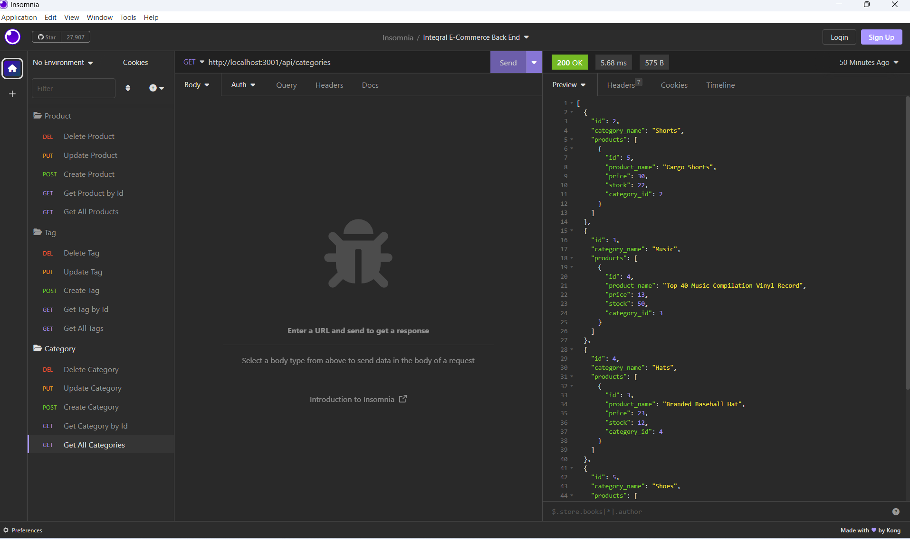

# Integral E-Commerce Back End

## Description 
---

Nowadays, e-commerce has become a pivotal part of world economy. There are many websites who help provide associated services, and this program in particular establishes a back end infrastructure for such websides. In this program, there are 3 main tables of `'category'`, `'product'` and `'tag'` that they have the following relationship between themselves: Each product belongs to a category and a category can have many products. Each product belongs to many tags and each tag can belong to many products that this many-to-many relationship is implemented through a connecting table called `'productTag'`.

 

This application can handle the following requests:

 

1. get all products or get a specific product by its id

2. create a new product

3. update an existing product

4. delete a specific product

5. get all tags or get a specific tag by its id

6. create a new tag

7. update an existing tag

8. delete a specific tag

9. get all categories or get a specific category by its id

10. create a new category

11. update an existing category

12. delete a specific category

 

## Table of Contents
---

* [Description](#description)

* [Mock Up](#mock-up)

* [Installation](#installation)

* [Usage](#usage)

* [Technology Used](#technology-used)

* [Questions](#questions)

* [Credit](#credit)

* [License](#license)

 

## Mock Up

---

### Requests in `'Insomnia'`

 

 

## Installation

---

In order to install this application, clone the repository and write the below command in terminal :

`npm i`

Then, execute the `'schema.sql'` file which is inside of the `'db'` folder, in your mySql environment. This file is resposible to create the database and the related tables. In case you are interested to see some sample data in each table, you can write the command of `'npm run seed'`in your console . Otherwise you can use the program to add your desired data.

 

## Usage

---

To run the program, enter the below command in console, and then follow the instructions:

`node server.js` 

or

`npm start`

This is a link to a video which instructs the users on how to work with software : 

[Walk-through Video Link](https://drive.google.com/file/d/1IGUUctjFNKNEghVuSbFQUGRiRCZDNtLd/view?usp=sharing)

 

## Technology Used

---

| Technology Used         |
| -------------           |
| JavaScript              |  
| Node.js                 |  
| Express.js              |
| MySQL2 Module           | 
| Sequelize Module        | 
| Dotenv Module           |

 

## Questions 

---

If you have any additional questions, you can send me an email to :

[My Email Address](mailto:(mer_ir@yahoo.com))

 

## Credit

---

Name:     Bahareh Hosseini

Github page:      [https://github.com/Bhmerir](https://github.com/Bhmerir)

 

## License

---

MIT License

Permission is hereby granted, free of charge, to any person obtaining a copy
of this software and associated documentation files (the "Software"), to deal
in the Software without restriction, including without limitation the rights
to use, copy, modify, merge, publish, distribute, sublicense, and/or sell
copies of the Software, and to permit persons to whom the Software is
furnished to do so, subject to the following conditions:

The above copyright notice and this permission notice shall be included in all
copies or substantial portions of the Software.

THE SOFTWARE IS PROVIDED "AS IS", WITHOUT WARRANTY OF ANY KIND, EXPRESS OR
IMPLIED, INCLUDING BUT NOT LIMITED TO THE WARRANTIES OF MERCHANTABILITY,
FITNESS FOR A PARTICULAR PURPOSE AND NONINFRINGEMENT. IN NO EVENT SHALL THE
AUTHORS OR COPYRIGHT HOLDERS BE LIABLE FOR ANY CLAIM, DAMAGES OR OTHER
LIABILITY, WHETHER IN AN ACTION OF CONTRACT, TORT OR OTHERWISE, ARISING FROM,
OUT OF OR IN CONNECTION WITH THE SOFTWARE OR THE USE OR OTHER DEALINGS IN THE
SOFTWARE.

---

© 2023 Confidential and Proprietary. All Rights Reserved.
